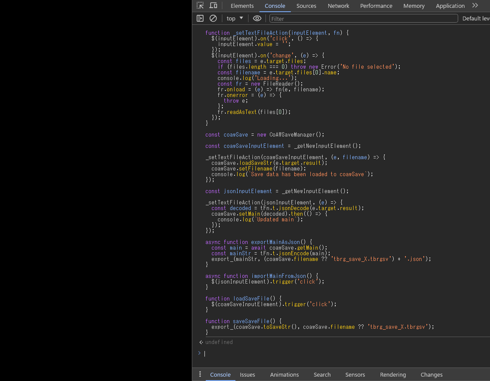
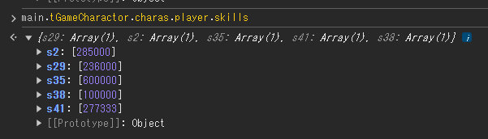

# Save Editor for Creator of Another World

Edit and view your save file of CoAW (`tbrg_save_*.tbrgsv`)

Backup existing save files first.

## Usage
1. Launch CoAW from your web browser (= open `(CoAW game directory)/game/index.html` with it).
2. Open the developer console.
3. Copy whole codes in [edit-save.js](https://github.com/Spoonail-Iroiro/coaw-save-editor/blob/master/edit-save.js) and paste it to the developer console and run.
4. Call `loadSaveFile()` and select your save file (`tbrg_save_*.tbrgsv`) to load it to the manager object (`coawSave`)
5. Edit 
  * (A) You can get the main section of the save as a javascript object by `const main = await coawSave.getMain()`. You can edit it (`main`) as you like and set it back by `await coawSave.setMain(main)` 
  * (B) You can get the main section of the save as a json file by `exportMainAsJson()`. Edit it with your favorite text editor and you can set it back by `importMainFromJson()`
6. `saveSaveFile()`

\* Google Chrome is the recommended browser. (CoAW DLSite ver. officially supports only this browser)  
\* When a file is exported, it's treated as a "download" by the browser, but this script does not communicate with the internet.

## Example
As an example, let's set the level of 'Strong Body' ability of the player to 20.

As described in the steps above, launch CoAW from Chrome and open the developer console.  
`F12` hotkey is disabled by the game, so you should manually open it (Menu > More Tools > Developer Tools).  


If you are playing Steam ver. and it's vanilla, you'll see just a black screen.  
However, this save editor works correctly even in this scenario, so it's not a problem.

Next, copy whole codes in `edit-save.js`, paste it to the console and press Enter.



Next, call `loadSaveFile()` (write it and press Enter) on the console and select your save file with the file browser.


Some messages will be displayed once loading is complete.


This time, we are following the step (A), editing the save through javascript object.  
As described in the step (B), you can also edit the save through json file.

First, call `coawSave.getMain()` and set the object to variable `main`.

```js
const main = await coawSave.getMain();
```

Now you can see actual structure and data of the save.  
Just type `main`, press Enter, expand the echoed result of object tree (click tiny ▶ next to the line).


It's useful for seek out where to edit for what you want to do.

This time, to set the level of 'Strong Body' ability of the player, we should edit `main.tGameCharactor.charas.player.skills`.  

Let's see the object.



In the object, `s38` contains the value for `Strong Body`, so update it to `[2000000]`


We've completed editing, so set the `main` object back to the save by `await coawSave.setMain(main)`


Then call `saveSaveFile()` to get it as a save file.
You'll receive it as a "downloaded" file.


Overwrite existing save file with it and launch the game normally...


👍

### How can I find where to edit?
- Explore the main object tree obtained by `coawSave.getMain()`
- Get a json file obtained by `exportMainAsJson()` before and after changing the value in the game and diff them
- Read the source code (most of the game's logics are in `CoAW/game/js/game/union.js`)

You can also seek help from someone in [CoAW modding Discord](https://discord.gg/RgYrD3uPZM)

## Contact
If you encounter any problems, please create an issue on this repository or contact Spoonail via [contact information provided here](https://whiteblackspace.hatenablog.com/contact-coaw)


